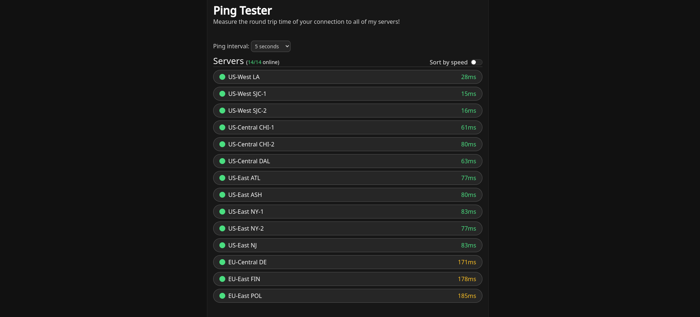

# Ping Tester


A simple website to track the ping of all your servers. View it live [here](https://ping.moocow.dev)!

## Installation
### Frontend (Node.js webserver)
1. Install [node.js v16](https://nodejs.org/download/release/v16.18.1/) or higher
2. Run `npm install`
3. Copy `config.js.example` to `config.js` to create the configuration file, and edit the server port if needed
4. Run `node index.js`
5. (Optional) Set up systemd to run the server 24/7. Paste the contents below to `/etc/systemd/system/ping-frontend.service` (you may need to edit the user, working directory or node path):
```
[Unit]
Description=Webserver for ping testing
Documentation=https://github.com/MooCowGalaxy/ping-test
After=network.target

[Service]
Type=simple
User=username
WorkingDirectory=/home/username/ping-test
ExecStart=/usr/bin/node /home/username/ping-test/index.js
Restart=on-failure

[Install]
WantedBy=multi-user.target
```
6. (Optional) Run `sudo systemctl daemon-reload && sudo systemctl enable --now ping-frontend` to run the server on startup.
### Backend websocket
1. Install [node.js v16](https://nodejs.org/download/release/v16.18.1/) or higher
2. Run `npm install`
3. Copy `config.js.example` to `config.js` to create the configuration file, and edit the websocket port if needed
4. Run `node websocket.js`
5. (Optional) Set up systemd to run the websocket server 24/7. Paste the contents below to `/etc/systemd/system/ping-ws.service` (you may need to edit the user, working directory or node path):
```
[Unit]
Description=Websocket for ping testing
Documentation=https://github.com/MooCowGalaxy/ping-test
After=network.target

[Service]
Type=simple
User=username
WorkingDirectory=/home/username/ping-test
ExecStart=/usr/bin/node /home/username/ping-test/websocket.js
Restart=on-failure

[Install]
WantedBy=multi-user.target
```
6. (Optional) Run `sudo systemctl daemon-reload && sudo systemctl enable --now ping-ws` to run the server on startup.
### Adding websocket servers
Once you've set up the frontend and websocket backend, you need to add the websocket server to the `config.js` file in the frontend:

Add a new entry to the servers list in `config.js`. The name can be anything you want, but must be unique. The domain can be set to the IP of the server, or a domain. It can also include a port (eg. `server.example.com:3001`).
### Enabling SSL
If you would like to use SSL for the frontend, you will need a reverse proxy like nginx. You also will need a [FQDN](https://en.wikipedia.org/wiki/Fully_qualified_domain_name) for every websocket server and valid SSL certificates.

#### Example steps for nginx (for frontend server):
1. Install [certbot](https://certbot.eff.org/) and the certbot nginx plugin
2. Obtain a certificate for the FQDN using the nginx plugin (`certbot certonly -d "ping.example.com"`)
3. Create/update the nginx config for the frontend server, example:
```
server {
    server_name ping.example.com;

    location / {
        proxy_pass http://localhost:3000;
        proxy_set_header X-Real-IP $remote_addr;
        proxy_set_header Host $host;
        proxy_set_header X-Forwarded-For $proxy_add_x_forwarded_for;

        proxy_http_version 1.1;
        proxy_set_header Upgrade $http_upgrade;
        proxy_set_header Connection "upgrade";
    }

    listen 443 ssl; # managed by Certbot
    ssl_certificate /etc/letsencrypt/live/ping.example.com/fullchain.pem;
    ssl_certificate_key /etc/letsencrypt/live/ping.example.com/privkey.pem;
    include /etc/letsencrypt/options-ssl-nginx.conf; # managed by Certbot
    ssl_dhparam /etc/letsencrypt/ssl-dhparams.pem; # managed by Certbot
}
server {
    if ($host = ping.example.com) {
        return 301 https://$host$request_uri;
    } # managed by Certbot

    server_name ping.example.com;

    listen 80;
    return 404; # managed by Certbot
}
```
#### Example steps for nginx (for websocket server):
1. Install [certbot](https://certbot.eff.org/) and the certbot nginx plugin
2. Obtain a certificate for the FQDN using the nginx plugin (`certbot certonly -d "us-west1.example.com"`)
3. Create/update the nginx config file for the websocket server, example:
```
server {
    server_name us-west1.example.com;

    location / {
        proxy_pass http://localhost:3001;
        proxy_set_header X-Real-IP $remote_addr;
        proxy_set_header Host $host;
        proxy_set_header X-Forwarded-For $proxy_add_x_forwarded_for;

        proxy_http_version 1.1;
        proxy_set_header Upgrade $http_upgrade;
        proxy_set_header Connection "upgrade";
    }

    listen 443 ssl; # managed by Certbot
    ssl_certificate /etc/letsencrypt/live/us-west1.example.com/fullchain.pem;
    ssl_certificate_key /etc/letsencrypt/live/us-west1.example.com/privkey.pem;
    include /etc/letsencrypt/options-ssl-nginx.conf; # managed by Certbot
    ssl_dhparam /etc/letsencrypt/ssl-dhparams.pem; # managed by Certbot
}
server {
    if ($host = us-west1.example.com) {
        return 301 https://$host$request_uri;
    } # managed by Certbot

    server_name us-west1.example.com;

    listen 80;
    return 404; # managed by Certbot
}
```
4. Edit `config.js` file in the frontend to update the domain if changed

## Supporting me
If you would like to support me, consider starring this repo! 😄